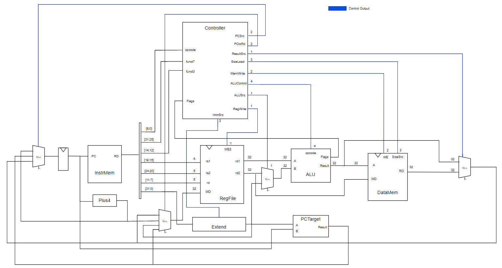
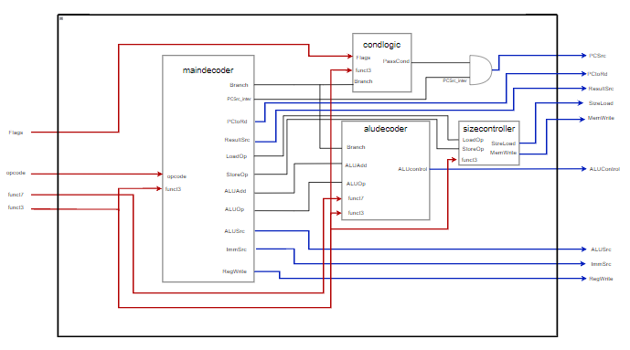
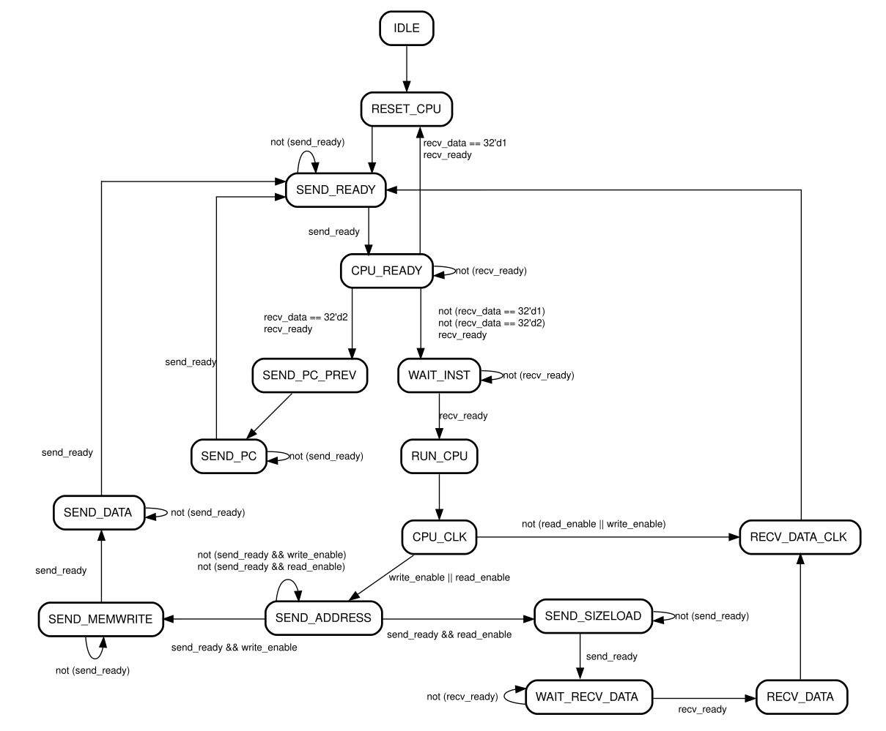
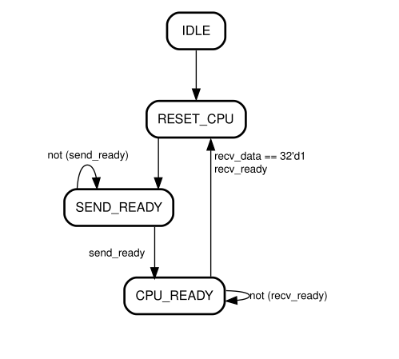
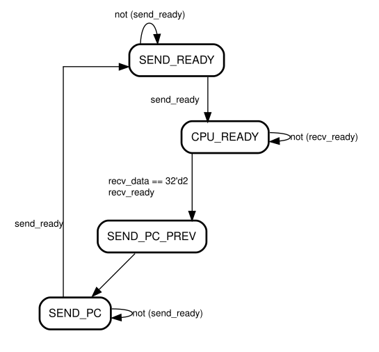
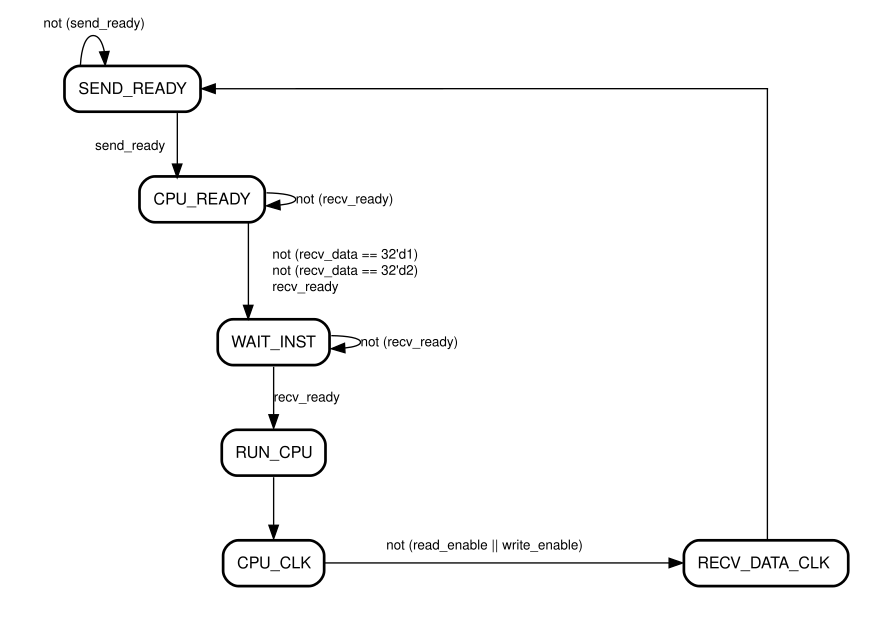

# System information
The (Name pending) is a 10Mhz single-cycle Risc-V processor that was designed as a part of the SSCS Chipathon proyect, fabricated in Skywater 130 technology.

## Cpu Diagram

## Controller Diagram

## Layout

## Comunication 

The comunication with the processor was made throught a UART Controller with the following parameters:

| Parameter | Value          |
|-----------|----------------|
| Baud Rate | 115200         |
| Parity    | No             |
| Bits      | 8              |
| Stop bit  | 1              |

The communication is handled by the following FSM .

But to simplify it we'll divide it into the following sequences:

- Restarting the system.
- Getting the previous program counter.
- Sending a non-Memory instruction.
- Sending a Memory instruction.

## Restarting the system

- After getting the CPU_Ready confirmation bit, by sending a  8'h01  byte the controller enters the cpu_reset State.
- Note that while this does reset the program counter, it does not reset the registers.
## Getting the previous program counter

- After getting the CPU-Ready confirmation bit, by sending a  8'h02  byte the controller enters the cpu_reset State.
- The controller will send the 32 bit Program counter through uart, afterwards it will send the CPU_Ready confirmation bit.

## Sending a non-Memory instruction

- After getting the CPU_Ready confirmation bit, by sending a non 1 or 2 byte the controller awaits for an instruction in the Wait_inst state.
- After sending an instruction the controller awaits for the processor to finish processing it.
- When its done it will send the CPU_Ready Confirmation Bit.

## Sending a Memory instruction

- After getting the CPU_Ready confirmation bit, by sending a non 1 or 2 byte the controller awaits for an instruction in the Wait_inst state.
- After sending an instruction the controller awaits for the processor to finish processing it.
- Then it goes into goes into the Send_Adress state, where it sends the 32-bit calculated adress.
- Afterwards depending if it was a write instruction, the controlles goes into the send_memwrite state, where it sends two bits, representing read_enable and write_enable respectevly, afterwards it sends the written data.
- If it was a read instruction it will enter the send_sizeload stage,  where it will send the size of read thata, afterwards it will send the read data.

## Issues

- The Shift instructions suffer issues as they shift the output register by the whole lenght of the second input register, instead of the first 5 bits. Affected instructions are:
    - slli
    - ...
- The registers values dont change after a reset, both manual and the one sent by uart.